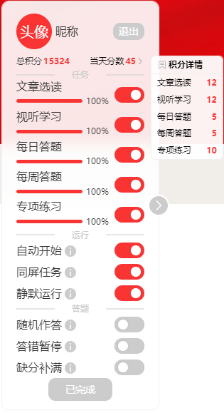

# tech-study.js

### 原仓库：

> https://github.com/TechXueXi/techxuexi-js

### 描述 Description

- 灵活且貌似轻量的 `学习强国` 油猴插件。
- A flexible and light userscript for xuexiqiangguo based on tampermonkey plugin.

### 用法 Usage

1. 装个浏览器插件 tampermonkey （可以从这里下载 https://github.com/TechXueXi/Tampermonkey ，网上也很多教程）
2. 点击插件里添加按钮，去掉编辑框里原来的代码，复制 `tech-study.js` 脚本复制粘贴进编辑框保存。
3. 开启这个脚本，然后进入网页强国 `www.xuexi.cn` ，登录网页。

### 优化 Promote

1. 优化整体交互设计，新增一体式扫码登录
2. 新增用户信息显示，包括昵称、头像、总分以及当天分数
3. 新增任务进度显示，优化显示逻辑
4. 修复部分小 bug，优化答题逻辑

### 使用流程 Process

1. 登录


2. 点击 `开始学习`，等待完成学习
3. 完成学习



### 更新与维护 Update and Maintenance

1. 优化答题逻辑，提高答案正确率，提升答题速度。
2. 答题存在滑动验证问题，暂时无法解决。
3. 考虑发布基于`Node.js`以及`puppeteer`的全套解决方案，筹备中...

### 关于开发

- 脚本配置

  1. 脚本配置 `src/config/script.ts`
  2. API 配置 `src/config/api.ts`
  3. URL 配置 `src/config/url.ts`
  4. 编译配置 `src/config/compile.ts`

- CSS 文件

  `src/css/index.css`

  - 根据特性（i）

    ```js
    // 将文件'./css/index.css'文本内容赋值到'css'
    import css from './css/index.css?raw';
    ```

  - 根据 Tampermonkey API 函数

    ```js
    // 嵌入样式
    GM_addStyle(css);
    ```

- 脚本内容

  `src/tech-study.ts`

- 编译

  ```
  # 编译生成 'tech-study.js'
  pnpm build
  ```

  即

  ```
   ✔ 完成编译:tech-study.ts -> tech-study.js!
   ✔ 完成编译:./config/url.ts -> tech-study.js!
   ✔ 完成编译:./config/api.ts -> tech-study.js!
   ✔ 完成编译:./utils/index.ts -> tech-study.js!
   ✔ 导出文件:../tech-study.js!
  ```

- 功能特性（基于`TypeScript Compiler API`）

  1. 包含`?raw`结尾的`import`语句

     ```
     import var from 'file?raw';
     ```

     1. 文件`file`文本内容赋值到`var`
     2. 此类型`import`语句不会被编译到结果

  2. 普通的`import`语句

     ```
     import {funName} from 'file';
     ```

     1. 文件`file`文本插入到主文件一起导出，相当于合并多个`*.ts`文件导出为一个`*.js`文件
     2. 此类型`import`语句不会被编译到结果
